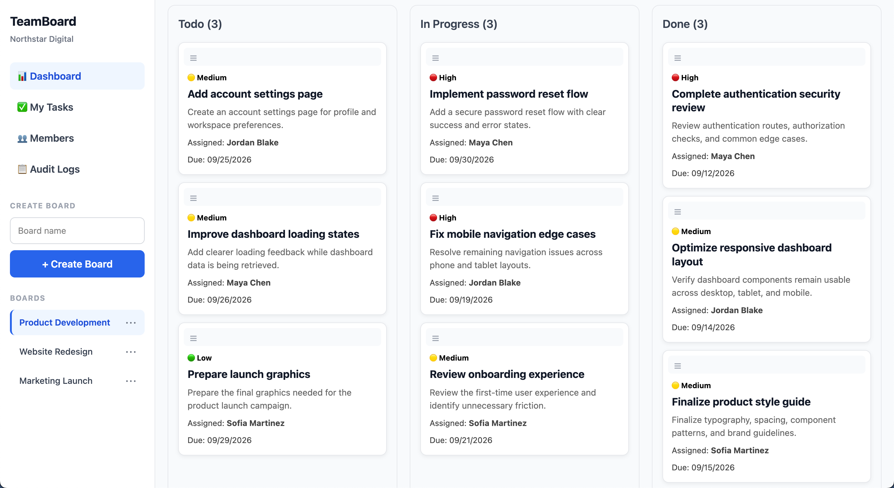
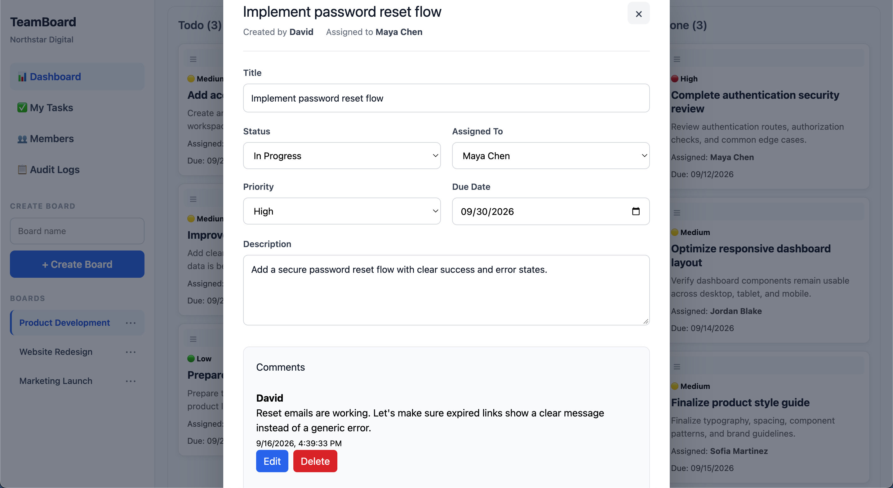
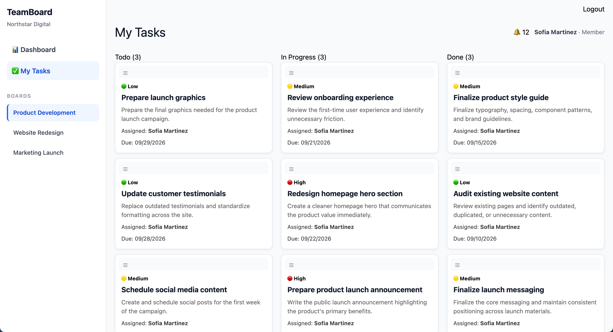
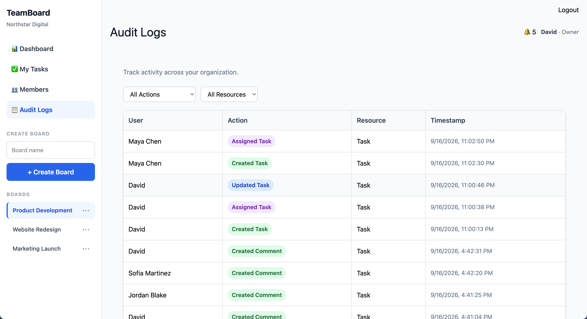
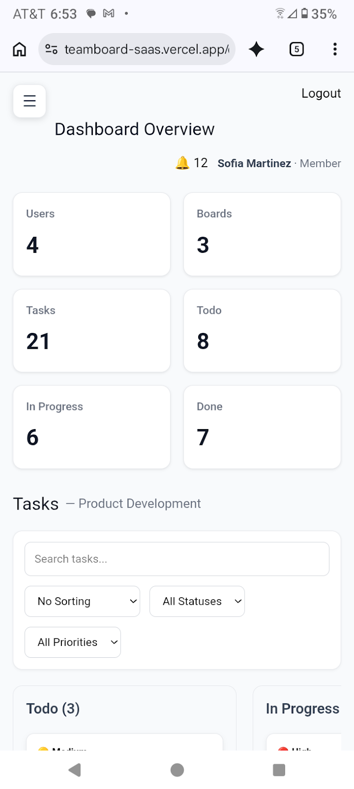

# TeamBoard

**A production-style, multi-tenant project management SaaS application
built with React, Node.js, Express, MongoDB, and real-time
collaboration.**

TeamBoard is a full-stack project management platform where
organizations can manage boards, tasks, members, comments,
notifications, invitations, and activity within a secure shared
workspace.

The project was built to demonstrate software engineering beyond basic
CRUD, with particular emphasis on **multi-tenant data isolation,
role-based authorization, real-time collaboration, backend security,
responsive UX, automated testing, and continuous integration**.

**Live Demo:** https://teamboard-saas.vercel.app\
**Repository:** https://github.com/DavidN-code/teamboard-saas

------------------------------------------------------------------------

## Product Preview



TeamBoard combines organization-scoped Kanban boards with task
assignment, comments, notifications, activity tracking, member
management, and role-based permissions.

------------------------------------------------------------------------

## Key Features

### Project Management

-   Kanban boards with **Todo**, **In Progress**, and **Done** workflows
-   Drag-and-drop task management for authorized users
-   Task creation, editing, deletion, and assignment
-   Priority levels and due dates
-   Task search, status/priority filters, and sorting
-   Personal **My Tasks** view across boards
-   Organization and task metrics

### Collaboration

-   Task-specific comment threads
-   Assignment and comment notifications
-   Organization-wide activity feed
-   Per-task activity history
-   Real-time task, comment, activity, and notification updates
-   Multi-tab and multi-client synchronization

### Organizations & Access Control

-   Organization-based multi-tenancy
-   **Owner**, **Admin**, and **Member** roles
-   Server-enforced Role-Based Access Control (RBAC)
-   Organization member management
-   Secure invitation-based onboarding
-   Email invitation workflow
-   Role-aware navigation and controls

### Audit & Accountability

TeamBoard records important workspace activity, including task creation
and updates, assignments, comments, invitations, role changes, member
removal, and other organization activity.

Audit records include user attribution and timestamps and are available
through organization-level and task-level views.

------------------------------------------------------------------------

## Application Screenshots

### Task Details & Collaboration

Task details combine status, assignment, priority, due dates,
descriptions, and threaded comments in one workflow.



### My Tasks

Members can see work assigned to them across the organization's boards
in a single view.



### Members & RBAC

Owners and admins can review organization membership and manage
role-appropriate access.


### Organization Activity

The activity feed provides a human-readable history of collaboration and
task changes.


### Audit Logs

Administrative audit logs provide structured filtering and visibility
into organization activity.



### Responsive Mobile UI

The application is designed to remain usable across desktop, tablet,
portrait, and landscape layouts.



------------------------------------------------------------------------

## Engineering Highlights

### Multi-Tenant Data Isolation

TeamBoard uses organization-based tenancy. Protected resources are
scoped to an `organizationId`, and authorization is enforced by the
backend rather than relying on frontend visibility.

Tenant boundaries cover resources including users, boards, tasks,
comments, audit logs, and invitations. Automated security tests verify
that users cannot access protected resources belonging to another
organization.

### Role-Based Authorization

| Role | Access |
| --- | --- |
| **Owner** | Full workspace access, role/member management, board management, invitations, and audit logs |
| **Admin** | Task management, member access, invitations, board creation, and audit logs |
| **Member** | Dashboard, My Tasks, task viewing/collaboration, comments, and notifications |

Authorization is enforced server-side with authentication and role
middleware. The backend reloads the authenticated user's current
authorization state from the database so authorization changes are not
determined solely by stale client-side state.

### Secure Real-Time Collaboration

Real-time functionality is implemented with **Pusher** using
authenticated private channels for organizations, boards, tasks, and
individual users.

Channel authorization verifies the requesting user's relationship to the
requested resource before allowing a subscription. This keeps real-time
events subject to the same tenant boundaries as the REST API.

### API Security & Validation

Backend protections include:

-   JWT authentication
-   bcrypt password hashing
-   Server-enforced RBAC
-   Tenant-scoped database queries
-   Request validation with `express-validator`
-   MongoDB ObjectId validation
-   Helmet security headers
-   API rate limiting
-   Centralized error handling
-   Restricted update fields
-   Server-side resource ownership validation

### Invitation Security

Invitation onboarding validates invitation tokens and normalized email
addresses before creating a user in the invited organization. Pending
invitations are organization-scoped, and invitation email delivery is
handled through **Resend**.

------------------------------------------------------------------------

## Automated Testing

The backend includes **32 automated integration and security regression
tests** using **Jest**, **Supertest**, and **mongodb-memory-server**.

The suite covers critical behavior including:

-   Registration and login
-   Protected-route authentication
-   Role-based authorization
-   Current-role enforcement after role changes
-   Cross-organization user isolation
-   Board and task tenant isolation
-   Assignment restrictions
-   Comment tenant isolation
-   Audit-log and activity isolation
-   Request and ObjectId validation

``` bash
npm test
```

Current test status:

``` text
Test Suites: 4 passed, 4 total
Tests:       32 passed, 32 total
```

### Continuous Integration

**GitHub Actions** installs backend dependencies and runs the automated
test suite on pushes and pull requests, providing regression protection
for authentication, authorization, validation, and tenant-isolation
behavior.

------------------------------------------------------------------------

## Tech Stack

  -----------------------------------------------------------------------
  Area                                Technologies
  ----------------------------------- -----------------------------------
  **Frontend**                        React, Vite, React Router, Axios,
                                      dnd-kit, CSS, Pusher JS

  **Backend**                         Node.js, Express, Mongoose, JWT,
                                      bcrypt, express-validator, Helmet,
                                      express-rate-limit

  **Database**                        MongoDB Atlas

  **Real-Time**                       Pusher private channels

  **Email**                           Resend

  **Testing**                         Jest, Supertest,
                                      mongodb-memory-server

  **CI**                              GitHub Actions

  **Deployment**                      Vercel (frontend), Render (backend)
  -----------------------------------------------------------------------

------------------------------------------------------------------------

## Architecture

``` text
React / Vite Frontend
        |
        | REST API + JWT
        v
Node.js / Express API
        |
        +---- Authentication & RBAC
        |
        +---- Tenant-scoped controllers
        |
        +---- Request validation
        |
        +---- Pusher authorization
        |
        v
MongoDB Atlas

Node.js / Express API
        |
        v
Pusher Private Channels
        |
        v
Real-Time React Clients
```

Core application data is organized around an organization boundary:

``` text
Organization
    |
    +-- Users
    +-- Boards
    |     |
    |     +-- Tasks
    |           |
    |           +-- Comments
    |
    +-- Invitations
    +-- Notifications
    +-- Audit Logs
```

For additional design notes, see
[`docs/system-design.md`](docs/system-design.md).

------------------------------------------------------------------------

## Selected API Endpoints

### Authentication

``` text
POST /api/auth/register
POST /api/auth/login
```

### Tasks

``` text
GET    /api/tasks/board/:boardId
POST   /api/tasks
PUT    /api/tasks/:id
DELETE /api/tasks/:id
```

### Comments

``` text
GET    /api/comments/task/:taskId
POST   /api/comments
PUT    /api/comments/:id
DELETE /api/comments/:id
```

### Users & Audit Logs

``` text
GET    /api/users
PUT    /api/users/:id/role
DELETE /api/users/:id

GET    /api/audit-logs
GET    /api/audit-logs/task/:taskId
```

------------------------------------------------------------------------

## Running Locally

### Prerequisites

-   Node.js
-   npm
-   MongoDB

### Clone and install

``` bash
git clone https://github.com/DavidN-code/teamboard-saas.git
cd teamboard-saas

cd backend
npm install

cd ../frontend
npm install
```

### Environment Configuration

Configure the required environment variables for the backend and
frontend. Backend services include MongoDB, JWT authentication, Resend,
and Pusher.

Example backend variable names:

``` text
MONGO_URI
JWT_SECRET
FRONTEND_URL
RESEND_API_KEY
PUSHER_APP_ID
PUSHER_KEY
PUSHER_SECRET
PUSHER_CLUSTER
```

The frontend also requires its deployed/local API URL and Pusher client
configuration.

Do not commit `.env` files or credentials to source control.

### Start the application

Run the backend:

``` bash
cd backend
npm run dev
```

In another terminal, run the frontend:

``` bash
cd frontend
npm run dev
```

Vite serves the frontend locally, while the Express API runs separately.

------------------------------------------------------------------------

## Project Status

TeamBoard's planned portfolio scope is **feature-complete and
deployed**.

The finished project includes authentication and onboarding,
multi-tenant isolation, RBAC, Kanban task management, assignments,
comments, notifications, invitations, member management, audit logging,
activity feeds, metrics, search/filtering/sorting, real-time
collaboration, responsive UI, security hardening, automated
integration/security tests, CI, and production deployment.

------------------------------------------------------------------------

## What This Project Demonstrates

TeamBoard was built as a flagship full-stack portfolio project and
demonstrates experience with:

-   Designing a multi-tenant SaaS architecture
-   Building REST APIs with Node.js and Express
-   Modeling application data with MongoDB and Mongoose
-   Building responsive React interfaces
-   Implementing authentication and server-side authorization
-   Enforcing tenant boundaries across application resources
-   Securing real-time communication
-   Designing role-based product behavior
-   Building collaborative real-time features
-   Writing integration and security regression tests
-   Configuring continuous integration
-   Deploying and debugging a full-stack application across multiple
    services

------------------------------------------------------------------------

## Author

**David Neagoy**

GitHub: https://github.com/DavidN-code
